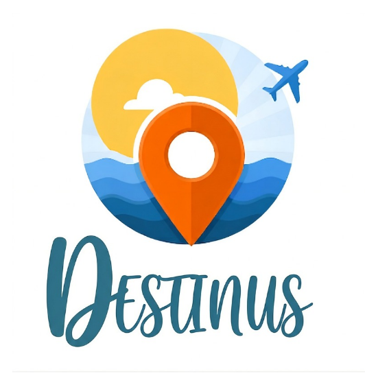
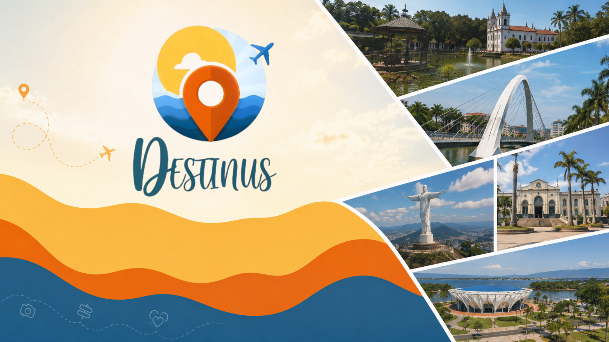

<div align="center">



# ♿ Destinus

### Turismo e mobilidade acessível para todos

Mapeie, avalie e descubra locais e experiências acessíveis perto de você.




</div>

---

## 📖 Sobre o projeto

O **Destinus** é um aplicativo mobile que ajuda pessoas com deficiência ou mobilidade reduzida a encontrar, avaliar e compartilhar locais realmente acessíveis — trilhas, museus, restaurantes, igrejas e pontos turísticos — com foco inicial na região da **Baixada Fluminense (Duque de Caxias, RJ)**.

Mais do que um guia turístico, o app foi pensado para se **adaptar ao usuário**, e não o contrário: o onboarding define um perfil de acessibilidade (baixa visão, cegueira, Libras ou neurodivergência) e todo o app — cores, tamanho de fonte, espaçamento, som — se ajusta automaticamente a partir dessa escolha.

> 💡 O nome **Destinus** remete a "destino" — o compromisso do projeto é que a acessibilidade seja o destino, não um obstáculo no caminho.

---

## ✨ Funcionalidades

### 🧭 Para o viajante
- **Onboarding de acessibilidade** — escolha entre navegação padrão, baixa visão, cegueira, Libras ou modo neurodivergente logo no cadastro, e o app inteiro se adapta ao perfil.
- **Explorar locais** — busca e filtro de estabelecimentos por categoria (Trilhas & Natureza, Cultura & História, Gastronomia, Comércio Local) e por tipo de necessidade de acessibilidade.
- **Mapa interativo** — visualização dos locais com integração ao Google Maps para rotas.
- **Detalhes de acessibilidade por local** — informações específicas como rampas, piso tátil, banheiro adaptado, audiodescrição e sinalização sonora.
- **Cadastro colaborativo de locais** — qualquer usuário pode adicionar um novo estabelecimento, com nome, endereço, imagem e recursos de acessibilidade.
- **Reservas** — solicitação de reservas para passeios, hospedagens e experiências, com histórico e status de acompanhamento.
- **Notificações** — recomendações do dia, dicas de acessibilidade e atualizações de reservas.
- **Perfil personalizado** — edição de foto, preferências de navegação e histórico de locais visitados recentemente.

### ♿ Recursos de acessibilidade
- **Intérprete virtual de Libras (VLibras)** — avatar flutuante integrado via WebView, usando o widget oficial do governo brasileiro.
- **Leitura em voz alta (Text-to-Speech)** — narração de telas e ações via `expo-speech`.
- **Temas adaptativos** — paleta de cores, espaçamento entre letras e altura de linha ajustados automaticamente para o modo neurodivergente.
- **Escala de fonte dinâmica** — todo o app responde a um fator de escala de texto.

### 🗺️ Fonte de dados dos locais
Além dos locais cadastrados manualmente (armazenados no `db.json`), o backend enriquece a busca em tempo real consultando a **[Overpass API](https://overpass-api.de/)** (OpenStreetMap) para trazer pontos turísticos, restaurantes, cafés e espaços de lazer da região automaticamente.

---

## 🏗️ Arquitetura

O projeto é dividido em dois pacotes independentes:

```
Destinus/
├── destinus-backend/     # API REST em Node.js + Express + TypeScript
│   ├── src/
│   │   ├── config/       # Configuração de acesso ao "banco de dados"
│   │   ├── controllers/  # Regras de negócio (locais, autenticação, reviews)
│   │   ├── routes/       # Definição das rotas da API
│   │   └── server.ts     # Ponto de entrada do servidor
│   └── db.json           # Banco de dados leve (JSON), ideal para prototipagem
│
└── destinus-mobile/      # App mobile em React Native + Expo + TypeScript
    ├── assets/           # Logo, banner e imagens estáticas
    └── src/
        ├── components/   # Componentes reutilizáveis (ex: LibrasAvatar)
        ├── config/        # Configuração de ambiente/API
        ├── constants/     # Tema, cores e constantes visuais
        ├── screens/       # Telas do app (Home, Explorar, Reservas, Perfil...)
        └── services/      # Camada de comunicação com a API
```

### Stack utilizada

| Camada | Tecnologias |
| :--- | :--- |
| **Mobile / Frontend** | React Native · Expo · TypeScript · Axios · Expo Speech · Expo Image Picker · React Native WebView |
| **Backend / API** | Node.js · Express · TypeScript · Axios · CORS · `tsx` (dev runner) |
| **Banco de Dados** | JSON local (`db.json`) — leve e ideal para prototipagem, com espaço para evoluir para um banco relacional/NoSQL |
| **Dados geográficos** | Overpass API (OpenStreetMap) para enriquecimento dinâmico de locais |
| **Acessibilidade** | Widget oficial VLibras (Governo Federal) e Text-to-Speech nativo |

---

## 🚀 Como executar o projeto

### Pré-requisitos
- **Node.js** instalado na máquina.
- **Aplicativo Expo Go** no celular *(opcional — dá para testar direto no navegador ou emulador)*.

### 1. Clonar o repositório
```bash
git clone https://github.com/seu-usuario/destinus.git
cd destinus
```

### 2. Rodar o backend
```bash
cd destinus-backend
npm install
npm run dev
```
O servidor sobe em `http://localhost:3333` (confira/ajuste a porta usada pelo app mobile em `src/services/api.ts` ou `src/config/api.ts`).

### 3. Rodar o app mobile
Em outro terminal:
```bash
cd destinus-mobile
npm install
npm start
```
Depois é só escanear o QR Code com o **Expo Go** ou rodar em um emulador/navegador (`npm run android`, `npm run ios` ou `npm run web`).

> ⚠️ **Importante:** se for testar em um celular físico na mesma rede Wi-Fi, edite a constante de IP local em `destinus-mobile/src/services/api.ts` (e/ou `src/config/api.ts`) para o IP da sua máquina, em vez de `localhost`.

---

## 🔌 Principais endpoints da API

| Método | Rota | Descrição |
| :--- | :--- | :--- |
| `GET` | `/api/locais` | Lista locais, com filtros por `query`, `category` e `necessidade` |
| `GET` | `/api/notificacoes` | Lista notificações do usuário |
| `PUT` | `/api/notificacoes/ler-todas` | Marca todas as notificações como lidas |
| `GET` | `/api/experiencias` | Lista experiências disponíveis |
| `GET` | `/api/reservas` | Lista reservas realizadas |
| `POST` | `/api/reservas` | Cria uma nova reserva |
| `POST` | `/api/cadastro` | Cadastra um novo usuário |
| `POST` | `/api/login` | Autentica um usuário |
| `PUT` | `/api/usuarios/:id/foto` | Atualiza a foto de perfil do usuário |

---

## 🗺️ Roadmap

- [ ] Migrar o banco de dados de JSON para PostgreSQL/MongoDB
- [ ] Autenticação com JWT e criptografia de senha
- [ ] Avaliações e comentários de acessibilidade por outros usuários
- [ ] Upload real de imagens (hoje via URL)
- [ ] Expansão para outras cidades além da Baixada Fluminense
- [ ] Testes automatizados (backend e mobile)

---

## 🤝 Contribuindo

Contribuições são muito bem-vindas! Sinta-se à vontade para abrir uma *issue* relatando bugs ou sugestões, ou enviar um *pull request*:

1. Faça um fork do projeto
2. Crie uma branch para sua feature (`git checkout -b feature/minha-feature`)
3. Faça commit das suas alterações (`git commit -m 'feat: minha nova feature'`)
4. Envie para o seu fork (`git push origin feature/minha-feature`)
5. Abra um Pull Request

---

## 📄 Licença

Este projeto está sob a licença MIT. Veja o arquivo `LICENSE` para mais detalhes.

---

<div align="center">

Feito com 💙 pensando em um turismo mais acessível para todos.

</div>
